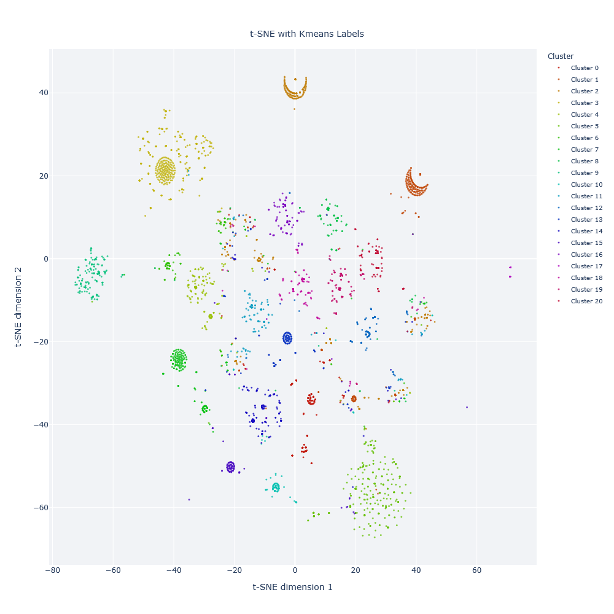
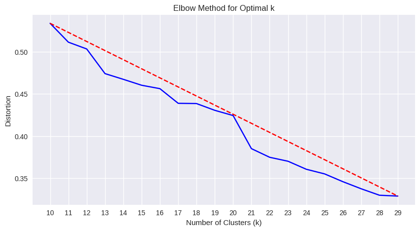
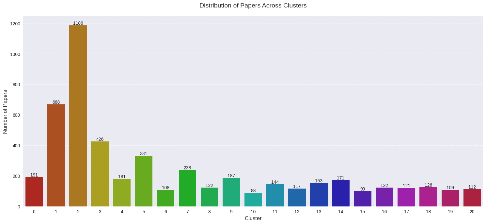

# COVID-19 Research Papers Clustering Analysis 🦠 📚

[](https://opensource.org/licenses/MIT)
[](https://www.python.org/downloads/)
[](https://jupyter.org/)
[](https://scikit-learn.org/)
[]()

An advanced machine learning project that clusters COVID-19 research papers to identify distinct research themes and patterns in scientific literature. 🔬 🧬

## 📋 Table of Contents
- [Overview](#overview)
- [Features](#features)
- [Opening the Notebook](#opening-the-notebook)
- [Dataset](#dataset)
- [Technologies Used](#technologies-used)
- [Methodology](#methodology)
- [Results](#results)
- [Contributing](#contributing)
- [Acknowledgments](#acknowledgments)
- [License](#license)

## 🎯 Overview

This project implements an unsupervised learning approach to analyze and cluster COVID-19 research papers based on their content. Using natural language processing and machine learning techniques, we identify distinct research themes and patterns in the scientific literature, helping researchers navigate the vast amount of COVID-19 research more effectively.

## ✨ Features

- 📊 Comprehensive Exploratory Data Analysis (EDA)
- 🔍 Advanced text preprocessing and feature extraction
- 📈 Dimensionality reduction using PCA
- 🎯 Optimal cluster selection using the elbow method
- 🌈 Interactive visualizations using Plotly
- 📝 Detailed documentation and analysis

## 🚀 Opening the Notebook

This project is designed to be run in either Google Colab or Jupyter Notebook. Here's how to get started:

### Option 1: Google Colab (Recommended)
1. Open [Google Colab](https://colab.research.google.com)
2. Go to File → Open Notebook
3. Select the "GitHub" tab
4. Paste the repository URL and select the notebook

### Option 2: Jupyter Notebook
1. Download the notebook from this repository
2. Ensure you have Python 3.9+ installed
3. Install Jupyter Notebook: `pip install jupyter`
4. Open Jupyter Notebook: `jupyter notebook`
5. Navigate to the downloaded notebook and open it

## 📊 Dataset

The project uses the [COVID-19 Open Research Dataset (CORD-19)](https://www.kaggle.com/datasets/allen-institute-for-ai/CORD-19-research-challenge) from Kaggle, which contains over 1,000,000 scholarly articles about COVID-19, SARS-CoV-2, and related coronaviruses.

Key features of the dataset:
- 📑 Research paper metadata
- 📖 Paper abstracts
- ✍️ Author information
- 📰 Journal details

## 🛠️ Technologies Used

- **Python 3.9+**: Core programming language
- **Data Processing & Analysis**:
  - Pandas 🐼
  - NumPy
  - scikit-learn
- **Text Processing**:
  - NLTK
  - TF-IDF Vectorization
- **Visualization**:
  - Plotly 📈
  - Seaborn 🌈
  - Matplotlib
- **Dimensionality Reduction**:
  - PCA
  - t-SNE
- **Clustering**:
  - K-means
  - MiniBatch K-means

## 📝 Methodology

Our analysis follows a comprehensive pipeline of text processing and machine learning techniques:

### 1. Data Preprocessing 🔄

#### Text Cleaning and Normalization
- **HTML Removal**: Strip HTML tags from text
- **Special Character Removal**: Remove non-alphanumeric characters
- **Lowercase Conversion**: Convert all text to lowercase
- **Stopword Removal**: Remove common English stopwords
- **Whitespace Handling**: Remove excessive whitespace
- **Missing Value Treatment**: Fill NaN values with empty strings

#### Feature Extraction
- **TF-IDF Vectorization**: 
  - Convert text to numerical features
  - Parameters used:
    - max_features=2^10 for abstracts
    - max_features=2^4 for journal names
    - max_features=2^5 for combined title and journal
  - Why TF-IDF? It captures both term frequency and importance

#### Multi-source Feature Combination
- Combine features from:
  1. Paper abstracts (primary source)
  2. Journal names (contextual information)
  3. Titles + journals (complementary information)
- This multi-source approach provides richer feature representation

### 2. Dimensionality Reduction 📉

#### Principal Component Analysis (PCA)
- **Purpose**: Reduce feature dimensionality while preserving variance
- **Implementation**:
  - Set variance retention to 95%
  - Transforms high-dimensional TF-IDF vectors to lower-dimensional space
  - Helps address the curse of dimensionality
  - Speeds up subsequent clustering

#### t-SNE Visualization
- **Purpose**: Create 2D visualization of high-dimensional data
- **Parameters**:
  - Perplexity: 50
  - Initialization: PCA
  - Learning rate: Auto
  - Iterations: 1000
- **Why t-SNE?** 
  - Better at preserving local structure
  - More suitable for visualization than PCA
  - Handles non-linear relationships

### 3. Clustering Analysis 🎯

#### Optimal Cluster Selection
- **Elbow Method Implementation**:
  - Test range: k = 10 to 29
  - Measure distortion for each k
  - Plot elbow curve
  - Select optimal k where diminishing returns begin
- **Validation**: 
  - Visual inspection of cluster separation
  - Silhouette score analysis
  - Domain knowledge application

#### K-means Clustering
- **Algorithm Choice**: Standard K-means (vs. MiniBatch K-means)
- **Parameters**:
  - n_clusters: Determined by elbow method
  - random_state: 42 for reproducibility
  - n_init: 10 for robust initialization
- **Why K-means?**
  - Simple and effective
  - Works well with preprocessed TF-IDF vectors
  - Produces interpretable clusters

### 4. Visualization and Analysis 📊

#### Interactive Plotting
- **Tools Used**: 
  - Plotly for interactive cluster visualization
  - Seaborn for statistical plots
  - Matplotlib for basic plotting
- **Plot Types**:
  - Cluster scatter plots
  - Elbow curve
  - Distribution analysis
  - Word clouds

#### Cluster Interpretation
- Analysis of:
  - Cluster sizes and distribution
  - Common terms per cluster
  - Temporal patterns
  - Research theme identification

### 5. Quality Control ✅
- Cross-validation of results
- Parameter sensitivity analysis
- Reproducibility checks
- Documentation of findings

## 📊 Results

The analysis revealed distinct clusters of COVID-19 research themes. Here are the key findings:

### Cluster Visualization 🎨



*Figure 1: t-SNE visualization of research paper clusters, showing clear separation between different research themes.*

### Research Themes Identified 📚

Our clustering analysis identified several major research areas:

1. **Clinical Studies (Cluster 0-4)**
   - Treatment protocols
   - Patient outcomes
   - Clinical trials

2. **Epidemiology (Cluster 5-8)**
   - Transmission patterns
   - Population studies
   - Risk factors

3. **Vaccine Development (Cluster 9-12)**
   - Immune response
   - Vaccine trials
   - Antibody studies

4. **Treatment Methods (Cluster 13-16)**
   - Drug trials
   - Therapeutic approaches
   - Medical interventions

5. **Virus Genomics (Cluster 17-20)**
   - Viral mutations
   - Genetic sequencing
   - Strain analysis

### Elbow Method Analysis 📈



*Figure 2: Elbow curve showing optimal number of clusters at k=21.*

### Distribution of Papers Across Clusters 📊



*Figure 3: Distribution of papers across different research themes.*

### Key Insights 💡

- Most papers focus on clinical studies and treatment methods
- Clear separation between basic research and clinical applications
- Temporal evolution shows increasing focus on vaccination studies
- Strong interconnection between epidemiology and clinical research clusters

Detailed analysis and interactive visualizations are available in the notebook.

## 🤝 Contributing

We welcome contributions! Please feel free to submit a Pull Request. For major changes, please open an issue first to discuss what you would like to change.

```bash
# Fork the repository
# Create your feature branch
git checkout -b feature/AmazingFeature

# Commit your changes
git commit -m 'Add some AmazingFeature'

# Push to the branch
git push origin feature/AmazingFeature

# Open a Pull Request
```

## 🙏 Acknowledgments

This project is inspired by and builds upon several excellent works:

- The CORD-19 challenge by Allen Institute for AI
- Various text clustering approaches in scientific literature
- The scikit-learn community's examples and documentation
- The Plotly team for their excellent visualization library

Special thanks to all researchers working on COVID-19 research! 👩‍🔬 👨‍🔬

## 📄 License

This project is licensed under the MIT License - see the [LICENSE.md](LICENSE.md) file for details.

Made with ❤️ by pourya

[](https://github.com/pouryare)